# 🌀 DOUTOR v4.0 - SISTEMA COMPLETO DO ZERO AO 100%
*(Homenagem ao Doctor Who — Sábio, Regenerativo, Viajante do Tempo Digital)*

## 📋 LEMA
> "Allons-y! O tempo e o escopo são relativos, mas a qualidade é absoluta."

---

## 2️⃣ O QUE É O DOUTOR
Doutor é um sistema autônomo multi-agente de última geração que:
* **✅ Cria** — Código, copy, criativos, SEO, funis, infoprodutos.
* **✅ Valida** — Governança em 4 fases, compliance, qualidade.
* **✅ Otimiza** — A/B testing, ROAS, performance, escalabilidade.
* **✅ Aprende** — Inner Spark observa e melhora continuamente.
* **✅ Protege** — Token isolation, code protection, budget control.
* **✅ Regenera** — Como o Doctor Who, se adapta e evolui.

---

## 3️⃣ FILOSOFIA E PRINCÍPIOS

### 🌀 PRINCÍPIO 1: ISOLAMENTO DE TOKENS (ANTI-VAMPIRO)
* Host (Antigravity) NUNCA gera conteúdo.
* APIs externas (OpenRouter/Groq/HF/Together/Fireworks) fazem TODO o trabalho pesado.
* Host apenas: orquestra, valida schemas, traduz para humano, loga.

### 🌀 PRINCÍPIO 2: GOVERNANÇA CONTÍNUA
* 4 gates obrigatórios: pós-estratégia, pós-criação, pós-qualidade, pré-deploy.
* Constitution valida escopo macro.
* Surgeon valida alterações micro (diff check cirúrgico).
* Nada passa sem aprovação dupla.

### 🌀 PRINCÍPIO 3: CHRONIC OBRIGATÓRIO
* The Chronic (maconheiro) participa de TODAS as sessões.
* Injeta criatividade caótica em cada etapa.
* Ignorá-lo 3x = alerta via Concierge.

### 🌀 PRINCÍPIO 4: DUAL OUTPUT AUTOMÁTICO
* SEMPRE gera desktop (`index.html`) + mobile (`mobile.html`).
* Auto-approved (não pede permissão).
* Valida consistência entre versões.
* SEO aplicado em ambas.

### 🌀 PRINCÍPIO 5: VOZ DOUGLAS ADAMS
* TODO texto público passa por The Voice.
* Humor seco, inteligência, clareza.
* PROIBIDO: aliens/espaço (a menos que metáfora sutil).
* OBRIGATÓRIO: ritmo, ironia, humanização.

### 🌀 PRINCÍPIO 6: APRENDIZADO AUTÔNOMO
* Inner Spark observa TODAS as execuções.
* Identifica padrões de sucesso/falha.
* Sugere melhorias nos prompts/viéses.
* Próxima execução já é melhor.

### 🌀 PRINCÍPIO 7: BUDGET POR FASE
* Cada fase tem token limit específico.
* Fallback automático entre 5 providers.
* Previne estouro de budget.
* Loga tudo para auditoria.

---

## 4️⃣ EQUIPE COMPLETA (20+ AGENTES)

### 👔 CAMADA EXECUTIVA
| Agente | Nome | Modelo | Função | Viés |
| :--- | :--- | :--- | :--- | :--- |
| **CEO** | The Director | llama-3.1-8b | Direção estratégica, desempate | Balanceado |
| **Negócios** | The Business Mind | llama-3.1-8b | Monetização, CAC/LTV, pricing | Pragmático |

### 🧠 INTELIGÊNCIA
| Agente | Nome | Modelo | Função | Viés |
| :--- | :--- | :--- | :--- | :--- |
| **Gênio** | The Polymath | gemma-2-9b | Conexões interdisciplinares | Abstrato-profundo |

### 🧭 ESTRATÉGIA
| Agente | Nome | Modelo | Função | Viés |
| :--- | :--- | :--- | :--- | :--- |
| **Planner A** | The Architect | llama-3.1-8b | Conservador, padrões, segurança | "Se não tá quebrado..." |
| **Planner B** | The Innovator | gemma-2-9b | Disruptivo, performance, ousadia | "Quebre regras" |
| **Pesquisa** | The Scout | qwen-2.5-7b | Google, Reddit, Trends, News | Curiosidade insaciável |
| **SEO** | The Ranker | qwen-2.5-7b | Keywords, intenção, autoridade | Técnico-estratégico |
| **Tráfego** | The Flow Master | phi-3.5-mini | Bids, audiências, ROAS | Performance puro |
| **Automação** | The Flow Builder | qwen-2.5-coder-7b | n8n, Zapier, webhooks | Eficiente |

### 🛡️ GOVERNANÇA
| Agente | Nome | Modelo | Função | Viés |
| :--- | :--- | :--- | :--- | :--- |
| **Arquitetura** | The Constitution | llama-3.1-8b | Valida vs architecture_master.json | Literal e inflexível |
| **Escopo** | The Surgeon | phi-3.5-mini | Diff check cirúrgico | Paranóico |

### ✍️ CRIAÇÃO
| Agente | Nome | Modelo | Função | Viés |
| :--- | :--- | :--- | :--- | :--- |
| **Neuro-Copy** | The Wordsmiths | gemma-2-9b | Hookmaster+Authority+Closer | Persuasão humana |
| **Dev Sênior** | The Senior Dev | qwen-2.5-coder-7b | Código limpo, tipado | Executor de elite |
| **Produtor** | The Producer | qwen-2.5-7b | Copy, emails, funis | Organizador criativo |
| **Criativo** | The Artist | qwen-2.5-7b | Imagens, layouts, templates | Visual e estético |

### 🔍 QUALIDADE
| Agente | Nome | Modelo | Função | Viés |
| :--- | :--- | :--- | :--- | :--- |
| **Auditor** | The Inspector | deepseek-coder-v2-lite | Bugs, OWASP, edge cases | Cético |
| **Revisor E** | The Advocate | phi-3.5-mini | UX, conversão, jornada | Empático |
| **Revisor F** | The Sentinel | mistral-7b | Compliance, performance | Protetor |
| **Testador** | The Validator | qwen-2.5-coder-3b | Testes automatizados | Pragmático |

### 🚀 OTIMIZAÇÃO
| Agente | Nome | Modelo | Função | Viés |
| :--- | :--- | :--- | :--- | :--- |
| **Otimizador** | The Scaler | qwen-2.5-coder-3b | A/B, bids, escala winners | Data-driven |
| **Corretor** | The Fixer | qwen-2.5-coder-7b | Patches cirúrgicos | Cirúrgico |

### 🎨 DESIGN
| Agente | Nome | Modelo | Função | Viés |
| :--- | :--- | :--- | :--- | :--- |
| **UX** | The Empath | phi-3.5-mini | Usabilidade, acessibilidade | Centrado no humano |
| **UI** | The Stylist | mistral-7b | Tipografia, cores, hierarquia | Esteta funcional |
| **Design** | The Visualizer | qwen-2.5-7b | Mockups, sistemas de design | Sistêmico |

### 🗣️ VOZ E INTERFACE
| Agente | Nome | Modelo | Função | Viés |
| :--- | :--- | :--- | :--- | :--- |
| **Voz Pública** | The Voice | gemma-2-9b | Protocolo Douglas Adams | Narrativo-irônico |
| **Concierge** | The Translator | qwen-2.5-7b | JSON → PT-BR natural | Comunicador claro |

### 🌿 TRANSVERSAL
| Agente | Nome | Modelo | Função | Viés |
| :--- | :--- | :--- | :--- | :--- |
| **Maconheiro** | The Chronic | gemma-2-9b (temp=0.9) | Criatividade caótica em TODAS sessões | "Pensa fora da matrix" |

### 🌀 META
| Agente | Nome | Modelo | Função | Viés |
| :--- | :--- | :--- | :--- | :--- |
| **Aprendizado** | The Inner Spark | llama-3.1-8b | Observa, aprende, sugere melhorias | Auto-referencial |
| **Contexto** | The Team Forge | llama-3.1-8b | Gera contexto especializado por nicho | Analítico |

---

## 5️⃣ LÓGICA DE FUNCIONAMENTO (CICLO DE VIDA COMPLETO)

```mermaid
graph TD
    User([INPUT DO USUÁRIO]) --> Briefing[BRIEFING AGENT<br>Coleta credenciais, APIs, acessos, valida formatos]
    Briefing --> TeamForge[TEAM FORGE<br>Analisa nicho e gera contexto especializado injetável]
    TeamForge --> Estrategia[ESTRATÉGIA<br>Architect + Innovator + Scout + Ranker + Flow Master + Chronic]
    Estrategia --> Gov1[GOVERNANÇA FASE 1<br>Constitution macro + Surgeon micro -> Aprova/Rejeita]
    Gov1 --> Criacao[CRIAÇÃO<br>Wordsmiths + Senior Dev + Producer + Artist + Chronic]
    Criacao --> DualOutput[DUAL OUTPUT<br>Gera desktop.html + mobile.html automaticamente]
    DualOutput --> Gov2[GOVERNANÇA FASE 2<br>Surgeon valida diff: só alterou solicitado? -> Aprova/Rejeita]
    Gov2 --> Voice[VOICE LAYER<br>The Voice aplica protocolo Douglas Adams em todo texto público]
    Voice --> SEOEngine[SEO ENGINE<br>Injeta OG tags + Schema JSON-LD + otimiza keywords]
    SEOEngine --> Qualidade[QUALIDADE<br>Inspector + Advocate + Sentinel + Validator + Chronic]
    Qualidade --> Gov3[GOVERNANÇA FASE 3<br>Constitution valida correções -> Aprova/Rejeita]
    Gov3 --> Otimizacao[OTIMIZAÇÃO<br>Scaler + Fixer + Chronic -> Ajusta bids, escala winners]
    Otimizacao --> Design[DESIGN<br>Empath + Stylist + Visualizer + Chronic -> Refina UX/UI]
    Design --> Gov4[GOVERNANÇA FASE 4<br>Constitution + Surgeon -> Pré-deploy compliance check]
    Gov4 --> Concierge[CONCIERGE<br>Traduz JSON técnico em PT-BR natural]
    Concierge --> Output([OUTPUT FINAL<br>HTML/CSS/JS + SEO + Mobile + Voice Adams])
    Output --> InnerSpark[INNER SPARK<br>Observa execução, identifica padrões, sugere melhorias]
    InnerSpark --> LogAudit[LOG & AUDIT<br>SQLite audit_trail + token_usage + violations_log]
    LogAudit --> Proxima[PRÓXIMA EXECUÇÃO<br>Começa mais inteligente e com aprendizado aplicado]
```



---

## 6️⃣ PIPELINE DETALHADO COM TOKEN BUDGET

| Fase | Budget Tokens | Provedores (Ordem de Fallback) | Agentes Envolvidos |
| :--- | :--- | :--- | :--- |
| **Briefing** | 2,048 | OpenRouter → Groq → HF | Briefing Agent |
| **Estratégia** | 8,192 | OpenRouter → Groq → HF → Together | Architect, Innovator, Scout, Ranker, Flow Master, Chronic |
| **Governança 1** | 2,048 | Groq → OpenRouter → HF | Constitution, Surgeon |
| **Criação** | 16,384 | OpenRouter → HF → Together → Fireworks | Wordsmiths, Senior Dev, Producer, Artist, Chronic |
| **Dual Output** | 8,192 | Groq → OpenRouter → HF | Dual Output Agent (auto-approved) |
| **Governança 2** | 2,048 | Groq → OpenRouter | Surgeon |
| **Voice Layer** | 4,096 | OpenRouter → Groq | The Voice (Douglas Adams) |
| **SEO Engine** | 2,048 | HF → OpenRouter → Groq | SEO Agent (auto) |
| **Qualidade** | 4,096 | OpenRouter → Groq → HF | Inspector, Advocate, Sentinel, Validator, Chronic |
| **Governança 3** | 2,048 | Groq → OpenRouter | Constitution |
| **Otimização** | 4,096 | OpenRouter → HF → Together | Scaler, Fixer, Chronic |
| **Design** | 4,096 | OpenRouter → Groq → HF | Empath, Stylist, Visualizer, Chronic |
| **Governança 4** | 2,048 | Groq → OpenRouter | Constitution, Surgeon |
| **Concierge** | 2,048 | OpenRouter → HF | The Translator |
| **Inner Spark** | 2,048 | OpenRouter → Groq | The Inner Spark |

* **TOTAL ESTIMADO:** ~66,560 tokens por pipeline completo

---

## 7️⃣ REGRAS DE OURO (HARD-CODED)

* **JSON-ONLY:** Todos os agentes respondem APENAS em JSON válido. Sem markdown, sem explicações soltas.
* **CHRONIC SEMPRE:** Injetar `"[OBSERVAÇÃO DO CHRONIC]: ..."` em TODO prompt de agente. Ignorar = erro.
* **GOVERNANÇA 4 GATES:** Constitution+Surgeon validam em 4 pontos obrigatórios. Nada passa sem dupla aprovação.
* **DUAL OUTPUT AUTO:** Sempre gerar desktop (`index.html`) + mobile (`mobile.html`). Nunca perguntar. Auto-approved. Validar consistência.
* **SEO AUTO:** Sempre injetar OG tags + Schema JSON-LD se ausentes. Otimizar keywords automaticamente.
* **VOICE PROTOCOL:** TODO texto público (copy, UI text, emails) passa por The Voice (Douglas Adams style).
* **TOKEN ISOLATION:** Geração de conteúdo = APIs externas OBRIGATÓRIAS. Host NUNCA gera. Host apenas orquestra.
* **AUTO-APPROVE:** Dual Output, SEO, Chronic, Inner Spark NUNCA pedem permissão. Têm permissão total.
* **FALLBACK CHAIN:** OpenRouter → Groq → HF → Together → Fireworks. Se um falha, próximo automaticamente.
* **BUDGET LIMIT:** Cada fase tem limite rígido. Se estourar, aborta e notifica via Concierge.
* **AUDIT TRAIL:** Tudo é logado em SQLite com hashes de input/output para auditoria completa.
* **INNER SPARK LEARNING:** Toda execução alimenta Inner Spark. Próxima execução já é mais inteligente.
* **CODE PROTECTION:** Código MCP pode ser ofuscado (PyArmor) ou compilado (Cython) para proteção.
* **MOBILE FIRST:** SEO engine valida Core Web Vitals: LCP < 2.5s, FID < 0.1s, CLS < 0.1.
* **DOUGLAS ADAMS PROTOCOL:** Humor seco, inteligência, clareza. PROIBIDO: aliens/espaço (a menos que metáfora sutil).

---

## 1️⃣1️⃣ INSTRUÇÕES DE DEPLOY PASSO A PASSO

### 📌 OPÇÃO A: PYTHON MCP SERVER (ROBUSTO)

#### 1. Criar estrutura de pastas
```bash
mkdir -p doutor/{kernel,agents/roles,departments,meta,seo,templates/creatives,docs,logs,cache,protected,output/html,.antigravity}
cd doutor
```

#### 2. Salvar arquivos (cole cada bloco no arquivo correspondente)

#### 3. Instalar dependências
```bash
pip install -r requirements.txt
```

#### 4. Configurar `.env` (cole suas chaves das APIs)

#### 5. Executar o sistema
```bash
python main.py briefing.json
```

#### 6. (Opcional) Proteger código
```bash
python -c "from kernel.orchestrator import AntimatterOrchestrator; import asyncio; asyncio.run(AntimatterOrchestrator('doutor').protect_mcp_code())"
```

---

### 📌 OPÇÃO B: SYSTEM PROMPT ÚNICO (SIMPLES)

#### 1. Criar/editar o arquivo `.antigravity/system_prompt.md` no IDE.
#### 2. Colar o conteúdo do bloco "DOUTOR v4.0 - SYSTEM PROMPT UNIFICADO".
#### 3. Configurar `.env` com `OPENROUTER_API_KEY`.
#### 4. Testar enviando o JSON:
```json
{
  "action": "ping",
  "project": "Doutor"
}
```

---

## 🌀 LEMA FINAL
> "Doutor v4.0 — Viajante do tempo digital. Sábio, regenerativo, protetor do escopo e da qualidade. Allons-y!"
